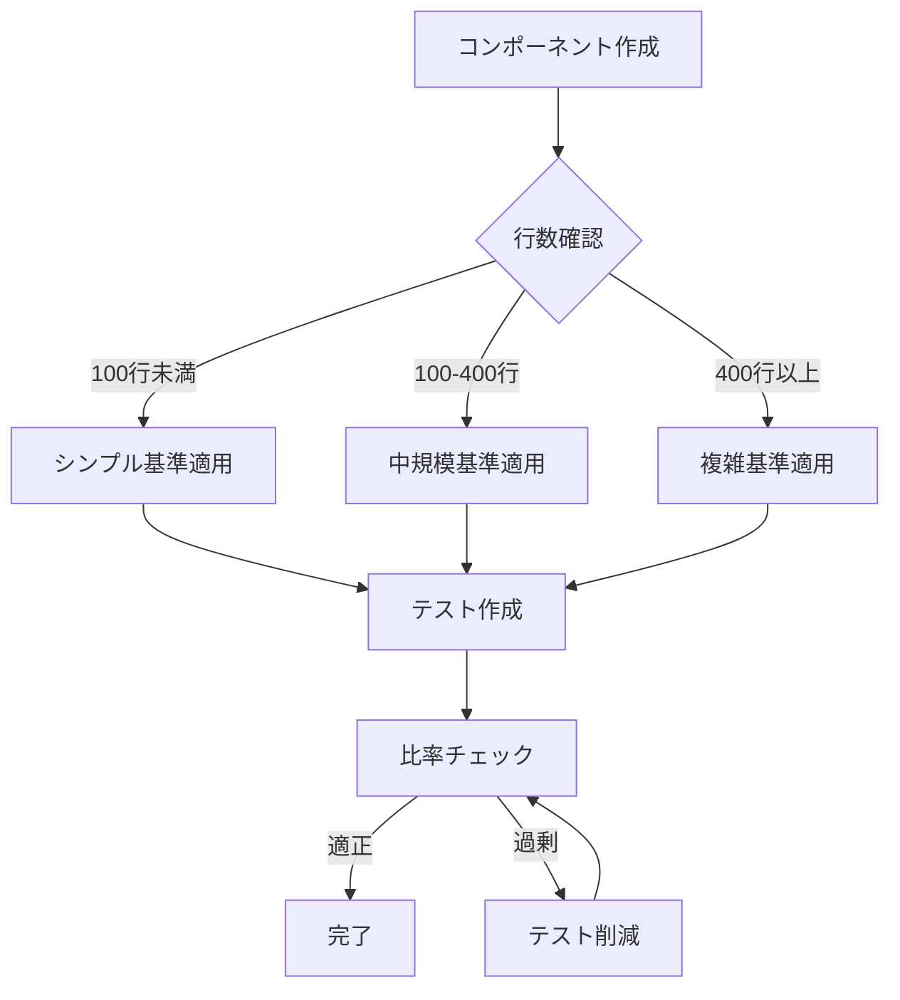

<!--
tags: #テスト #品質監視 #開発プロセス #継続的改善 #テスト分析 #パフォーマンス #重要
category: 品質保証
priority: 高
status: 作成中
created: 2025-01-19
test_analysis_tools: ["test-to-source-ratio", "storybook-analysis", "test-performance", "generate-report"]
-->

# テスト品質監視ガイド

## 概要

このドキュメントは、Saifuu プロジェクトにおけるテスト品質の継続的な監視と改善のためのガイドラインです。定期的な分析により、オーバーテストの防止とテスト効率の最適化を実現します。

## 監視の目的

1. **オーバーテストの防止**: 過度なテストによる開発効率の低下を防ぐ
2. **パフォーマンス改善**: 遅いテストを特定し、実行時間を最適化
3. **品質の一貫性**: プロジェクト全体でテスト品質を統一
4. **継続的改善**: データに基づいた改善サイクルの確立

## テスト分析ツール

### 1. テストコード比率分析

```bash
# 基本的な分析
npm run analyze:tests

# 詳細な分析（ファイル別）
npm run analyze:tests:verbose

# 特定プロジェクトの分析
npm run analyze:tests -- --project api

# 閾値超過ファイルのみ表示
npm run analyze:tests -- --threshold
```

**主な指標**:
- ソースコードとテストコードの行数比率
- コンポーネント複雑度別の適正比率
- 警告レベル（3倍以上）の検出

### 2. Storybookストーリー分析

```bash
# 基本的な分析
npm run analyze:storybook

# 重複パターンの検出
npm run analyze:storybook:duplicates
```

**主な指標**:
- ストーリー数とコンポーネント複雑度の関係
- 推奨ストーリー数との比較
- 重複パターンの検出

### 3. テストパフォーマンス分析

```bash
# 基本的な分析
npm run analyze:performance

# 特定プロジェクトの分析
npm run analyze:performance -- --project api

# 遅いテストのみ表示
npm run analyze:performance -- --slow

# 上位20個の遅いテストを表示
npm run analyze:performance -- --top 20
```

**主な指標**:
- テスト実行時間の分布
- 遅いテストの特定
- ファイル別の実行時間集計

### 4. 統合レポート生成

```bash
# 全プロジェクトのレポート生成
npm run analyze:report

# 特定プロジェクトのレポート
npm run analyze:report -- --project frontend

# カスタム出力先
npm run analyze:report -- --output reports/test-analysis.md
```

## 月次レビュープロセス

### 第1週: データ収集

1. **統合レポートの生成**
   ```bash
   npm run analyze:report
   ```

2. **結果の確認**
   - `docs/テスト/test-analysis-report.md` を確認
   - 警告レベルのファイルをリストアップ
   - パフォーマンス問題を特定

### 第2週: 分析と計画

1. **問題の優先順位付け**
   - オーバーテスト（3倍以上）のファイル
   - 実行時間3秒以上のテスト
   - 重複の多いStorybookストーリー

2. **改善計画の策定**
   - 各問題に対する具体的なアクション
   - 担当者の割り当て
   - 期限の設定

### 第3-4週: 改善実施

1. **テストコードのリファクタリング**
   - パラメタライズドテストの活用
   - 重複テストの統合
   - 不要なテストの削除

2. **パフォーマンス最適化**
   - セットアップ処理の共通化
   - モックの適切な使用
   - 並列実行の活用

## テストコードレビューチェックリスト

### 新規テスト作成時

- [ ] **適正な比率**: ソースコードに対するテストコード量は適切か？
  - シンプル（<100行）: 0.5-1.5倍
  - 中規模（100-400行）: 1-2倍
  - 複雑（400行以上）: 1.5-2.5倍
- [ ] **重複の確認**: 類似のテストケースが既に存在しないか？
- [ ] **実行時間**: 1秒以内で完了するか？
- [ ] **テスト種別**: ユニットテスト/Storybook/E2Eの使い分けは適切か？

### 既存テスト修正時

- [ ] **削減の機会**: 統合・削除できるテストはないか？
- [ ] **パフォーマンス**: 実行時間が悪化していないか？
- [ ] **保守性**: テストの意図が明確で理解しやすいか？

## 新規開発時のテスト基準適用フロー

### 1. コンポーネント作成時



### 2. 定期チェック

開発中は以下のコマンドで定期的に確認：

```bash
# 作業中のプロジェクトをチェック
npm run analyze:tests -- --project frontend --threshold

# パフォーマンスの確認
npm run analyze:performance -- --project frontend --slow
```

## 警告と対処法

### オーバーテスト警告（3倍以上）

**症状**: テストコードがソースコードの3倍を超える

**対処法**:
1. パラメタライズドテストで統合
2. 境界値テストの最適化
3. モックの過度な検証を削減

### パフォーマンス警告（3秒以上）

**症状**: 単一テストの実行時間が3秒を超える

**対処法**:
1. 不要な待機時間の削除
2. データベース/APIモックの使用
3. セットアップの最適化

### ストーリー過多警告（推奨の1.5倍以上）

**症状**: Storybookストーリーが推奨数を大幅に超過

**対処法**:
1. 視覚的差異のないストーリーを統合
2. ユニットテストへの移行を検討
3. インタラクションテストの活用

## 継続的改善のサイクル

```
監視 → 分析 → 計画 → 実施 → 検証 → 監視...
```

1. **監視**: 自動化されたツールによる定期的なデータ収集
2. **分析**: レポートから問題点と改善機会を特定
3. **計画**: 優先順位を付けて改善計画を策定
4. **実施**: 計画に基づいてテストコードを改善
5. **検証**: 改善効果を測定し、次のサイクルへ

## ベストプラクティス

### 効率的なテスト作成

1. **最初から適正な量を意識**
   - コンポーネントの複雑度を考慮
   - 基準値を参考に計画

2. **定期的な見直し**
   - 機能追加時にテストも見直す
   - 不要になったテストは削除

3. **チーム内での知識共有**
   - 月次レビューの結果を共有
   - 改善事例をドキュメント化

### ツールの活用

1. **開発中の確認**
   ```bash
   # コミット前のチェック
   npm run analyze:tests -- --threshold
   ```

2. **PRレビュー時**
   - 大きな変更時は分析結果を添付
   - レビュアーも基準を意識

3. **定期的な全体分析**
   ```bash
   # 月次でレポート生成
   npm run analyze:report
   ```

## 参考資料

- [テストガイド](./テストガイド.md) - テスト実装の詳細
- [オーバーテスト防止ガイドライン](./テストガイド.md#オーバーテスト防止ガイドライン) - 具体的な基準値
- [test-analysis-report.md](./test-analysis-report.md) - 最新の分析レポート