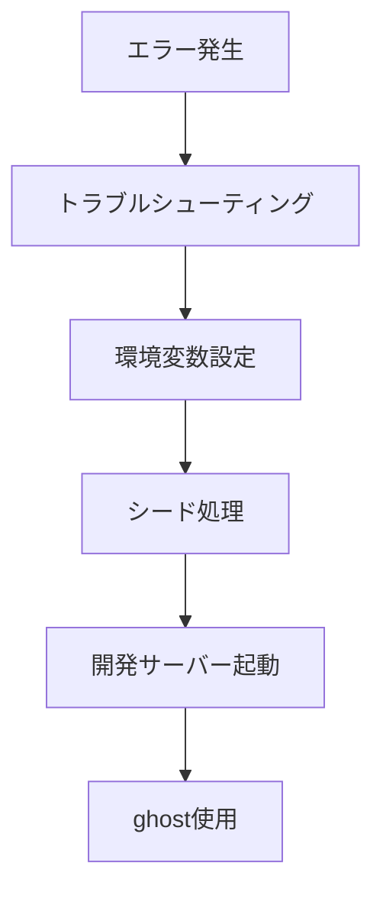

# 開発環境ドキュメント

<!-- tags: development-environment, setup, troubleshooting, tools, database -->

このディレクトリには、Saifuuプロジェクトの開発環境セットアップと運用に関するすべてのドキュメントが含まれています。

## 📋 ドキュメント一覧

| ドキュメント | 役割 | 対象 |
|-------------|------|------|
| [シード処理ガイド](./シード処理ガイド.md) | データベース初期化・テストデータ投入 | **必須** - 全開発者 |
| [環境変数設定ガイド](./環境変数設定ガイド.md) | 環境変数の設定方法 | **必須** - 全開発者 |
| [ghost使用ガイド](./ghost使用ガイド.md) | バックグラウンドプロセス管理 | **推奨** - 効率的な開発のため |
| [開発環境エラー修正プラン](./開発環境エラー修正プラン.md) | トラブルシューティング | **参考** - 問題発生時 |

## 🚀 クイックスタートガイド

### 初回セットアップ

1. **環境変数設定** 📝  
   → [環境変数設定ガイド](./環境変数設定ガイド.md)を参照してプロジェクト固有の設定を行う

2. **データベース初期化** 🗄️  
   → [シード処理ガイド](./シード処理ガイド.md)を参照してテストデータを投入
   ```bash
   npm run db:setup:dev
   ```

3. **開発サーバー起動** 🏃‍♂️  
   → [ghost使用ガイド](./ghost使用ガイド.md)を参照してバックグラウンド実行
   ```bash
   ghost run npm run dev
   ```

### 日常的な開発フロー

```bash
# 朝の作業開始時
npm run db:studio:dev  # データベース状態確認

# 開発サーバー起動（バックグラウンド）
ghost run npm run dev

# 作業中のリセットが必要な場合
npm run db:reset:dev
```

## ⚠️ トラブルシューティング

開発中に問題が発生した場合：

1. **一般的な環境エラー** → [開発環境エラー修正プラン](./開発環境エラー修正プラン.md)
2. **データベース関連エラー** → [シード処理ガイド](./シード処理ガイド.md)のトラブルシューティング章
3. **プロセス管理エラー** → [ghost使用ガイド](./ghost使用ガイド.md)

## 🔄 依存関係



## 📚 関連ドキュメント

- **API開発**: [../API開発/](../API開発/) - APIサーバーの設定
- **フロントエンド開発**: [../フロントエンド開発/](../フロントエンド開発/) - フロントエンド環境
- **テスト**: [../テスト/](../テスト/) - テスト環境の設定

---

**💡 ヒント**: 開発環境関連で新しいドキュメントを作成する場合は、このディレクトリに配置し、上記の一覧表を更新してください。